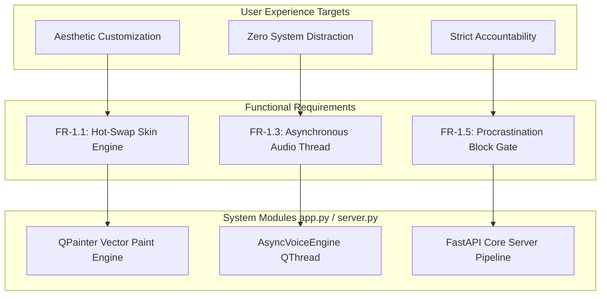

# AURA: Core Product Requirements Document (PRD)

This document establishes the official functional, non-functional, and technical requirements for **AURA: The Multi-Skin Desktop Kinetic Companion**.

---

## 📋 1. Functional Requirements Matrix (FR)

| Req ID | Module / Component | Description | Priority | Target Release |
| :--- | :--- | :--- | :--- | :--- |
| **FR-1.1** | Skin Engine | Application must support hot-swapping between three distinct visual themes (Cyber HUD, Kawaii Pet, Zen Oasis) on the fly without system restart [6.1]. | P0 | v1.0.0 (Current) |
| **FR-1.2** | Data Sync | Application must synchronize active task items, completions, and configuration preferences with the FastAPI cloud microservice [6.1]. | P0 | v1.0.0 (Current) |
| **FR-1.3** | Anti-Lag Audio | Voice prompts and sound chimes must run on non-blocking background loops (`QThreads`) to protect the frontend 60 FPS refresh rate. | P0 | v1.0.0 (Current) |
| **FR-1.4** | Health Prompts | The engine must intercept user workflow every 20 minutes with a randomized conversational telemetry hook before prompting hydration. | P0 | v1.0.0 (Current) |
| **FR-1.5** | Task Interlock | The system must block all boredom-buster mini-games if active uncompleted tasks in the database queue equal or exceed 3 items. | P1 | v1.0.0 (Current) |
| **FR-1.6** | System Tray | Minimise, mute sound, and hard exit overrides accessible via the Windows native taskbar system tray menu. | P1 | v1.2.0 (Next) |
| **FR-1.7** | Auth Architecture | User sign-up, session token hashing, and multi-profile login screens. | P2 | v1.5.0 (Future) |

---

## ⚙️ 2. Non-Functional Requirements Matrix (NFR)

| Req ID | Attribute | Metric / Validation Criteria | Priority | Status |
| :--- | :--- | :--- | :--- | :--- |
| **NFR-2.1**| Performance | Total background background idling footprint must remain below 75MB RAM to safely accommodate 8GB hardware laptop limits. | P0 | Verified |
| **NFR-2.2**| Latency | Local UI graphics loop must execute at a fixed tick rate of 33ms (approx. 30 FPS) with zero drop frames during active dragging. | P0 | Verified |
| **NFR-2.3**| Reliability | Network failure or backend server dropouts must trigger an automatic fallback to local SQLite memory cache with zero client crashes. | P0 | Verified |
| **NFR-2.4**| Visuals | Vector graphics must render via anti-aliased mathematical coordinates to prevent pixelation on modern high-DPI displays. | P1 | Verified |

---

## 🛠️ 3. Future Enhancements & Scope Management

*   **v1.2.0 Scope**: System tray control bindings, mute switches, and offline storage validation pipelines.
*   **v1.5.0 Scope**: Multi-tenant database migrations (PostgreSQL schemas) and integration with external productivity APIs (GitHub Issues, Notion).

## 🗺️ 4. Requirement Traceability Diagram

